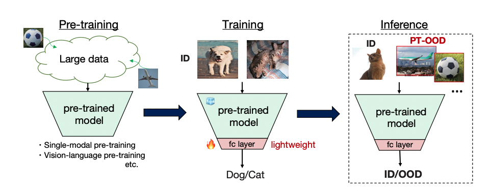
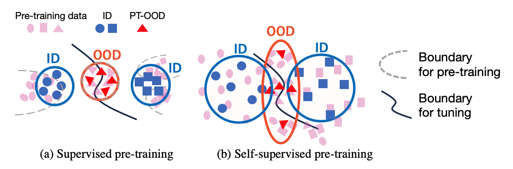

# Can Pre-trained Networks Detect Familiar Out-of-Distribution Data?

This repository contains PyTorch implementation for our paper：Can Pre-trained Networks Detect Familiar Out-of-Distribution Data?

### Abstract
Most studies for OOD detection did not use pre-trained models and trained a backbone from scratch. In recent years, transferring knowledge from large pre-trained models to downstream tasks by lightweight tuning has become mainstream for training classifiers. To bridge the gap between the practice of OOD detection and today's classifiers, the unique and crucial problem is that the samples whose information networks know often come as OOD input. Here, we define such OOD data as PT-OOD (Pre-Trained OOD) data. In this paper, we aim to reveal the effect of PT-OOD on the OOD detection performance of pre-trained networks from the perspective of pre-training algorithms. To achieve this, we explore the PT-OOD detection performance for supervised and self-supervised pre-training algorithms with linear-probing tuning, the most common efficient tuning method. Through our experiments and analysis, we find that the low linear separability of PT-OOD in the feature space heavily degrades the PT-OOD detection performance, and self-supervised models are more vulnerable to PT-OOD than supervised pre-trained models, even with state-of-the-art detection methods. To solve this vulnerability, we further propose a solution unique to large-scale pre-trained models: leveraging the powerful instance-by-instance discriminative representations of pre-trained models and detecting OOD in the feature space independent of ID decision boundaries.

## Note
We will publish the code and dataset used for training and eval upon acceptance. Thank you for your understanding. If you are interested in our work, you can press the "watch" botton to monitor this repository.
